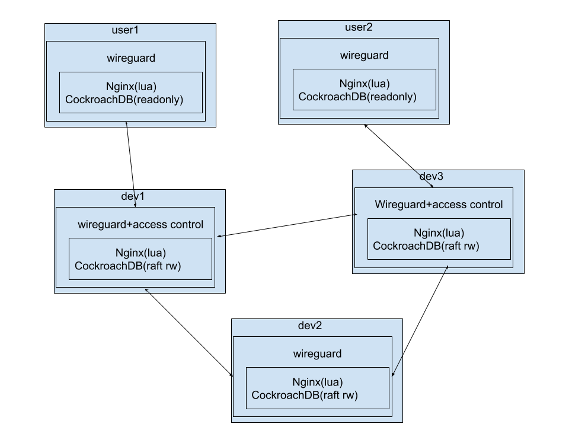

# OurGi-src
blockchain for group intelligence

OurGi mesh network:

区块链只是DAO(去中心自治组织)的一种实现方式, 含Raft共识算法的分布式数据库应该是另一种可能更容易的DAO实现方式

如果能在Raft共识算法的前面插入回调钩子就可以调用任何语言比如php来检查sql语句是否符合预先设置的业务逻辑, 开发者就能形成一个表决网络来发布php应用

目前问题: CockroachDB的共识算法在写入kv之前而不是在发出sql之前, rqlite的共识算法在发出sql之前但不像cockroachdb分range能让网络内所有节点都参与, rqite典型网络最多9个节点参与表决, 其他节点都是只读节点(https://github.com/cockroachdb/cockroach/issues/48007)

IBM公司也有人想把CockroachDB和Hyperledger集成起来, 可以关注: https://wiki.hyperledger.org/display/INTERN/Enabling+CockroachDB+as+a+State+Database+for+Hyperledger+Fabric

支持sql quorum才能成为通用DAO database(分布自治组织数据库)

raft leader's log is the truth, 所以raft不能算共识算法, bft才是

可惜Hyperledger Sawtooth PBFT的members管理是中心化的(默认由genesis block owner :https://sawtooth.hyperledger.org/docs/core/nightly/1-2/sysadmin_guide/pbft_adding_removing_node.html), 要是能以4个成员为起点在链上表决来增减成员就好了

hotstuff优化了bft, 把区块链和BFT步骤结合来减少通讯复杂度, scalable BFT: https://github.com/hot-stuff/libhotstuff
